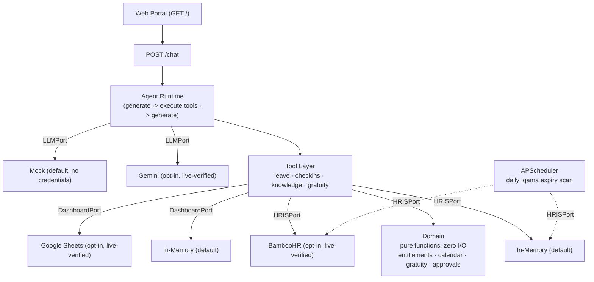

# HR Agent Service

A tool layer for an HR agent covering two workflows -- leave management and daily check-ins/team
performance -- for a multi-country industrial company (Saudi Arabia, UAE, Egypt, Jordan). In
production this sits behind HeyLua.ai (the agent/WhatsApp layer) and BambooHR (the HRIS); this repo
also includes a small local agent runtime and web portal so the whole thing can be run and reviewed
standalone, with zero external credentials.

## Why workflows 2 and 4

The brief listed several candidate workflows; this submission builds two, completely, rather than
several, shallowly. Leave management (balance, preview, submit, approve, escalation) and daily
check-ins/team performance (check-in, missing-check-in detection, weekly summary) were chosen
because together they exercise two genuinely different classes of problem: leave management is a
stateful, money-adjacent approval workflow (entitlement math, signed two-phase writes, server-side
authorization), while check-ins are high-frequency, low-stakes, and exercise different concerns
entirely (a dashboard integration, a scheduled job, aggregation over a time window). Building both
fully -- correct entitlement law for four countries, real idempotency, a real (if credential-gated)
vendor integration for each, actual end-to-end tests -- was judged more useful to evaluate than a
thinner pass across four or five workflows.

## Architecture



Every external dependency is a **port** (a `typing.Protocol`) with an in-memory/mock adapter as the
default and a real adapter as an opt-in, env-driven choice (`HRIS_DRIVER`, `DASHBOARD_DRIVER`,
`LLM_DRIVER`) -- the same shape repeated four times, not four different patterns. The **domain**
layer is pure functions with zero I/O: every number an agent or vendor could get wrong (leave
balance, working days, gratuity, tenure, SLA breach) is computed there and only there, never by the
LLM and never inline in a tool. Full write-up: [docs/ARCHITECTURE.md](docs/ARCHITECTURE.md). The
individual decisions behind this shape, with the tradeoffs considered:
[docs/DECISIONS.md](docs/DECISIONS.md).

## Run it

```bash
pip install -e ".[dev]"
make demo
```

That's it -- no `.env` required. `make demo` seeds a small in-memory org and drives both workflows
end to end through the real `POST /chat` endpoint, printing the conversation as it happens. Every
driver defaults to memory/mock regardless of what a real `.env` might configure, so this works
identically on a fresh clone or a fully-configured one.

To run the API itself: `make dev` (serves the web portal at `/` and the chat API at `/chat`). To run
the test suite: `make test` (289 tests, zero external credentials). To lint: `make lint`.

## What's mock, what's verified, and why

Every real vendor integration was either verified against a live account or built and honestly
flagged as unverified -- never assumed correct and left ambiguous.

| Integration | Default | Real driver | Verification |
|---|---|---|---|
| HRIS (`HRISPort`) | `memory` | `bamboohr` | **Live-verified.** Every method tested against a real BambooHR trial account, both reads and writes. Found and fixed ~7 real discrepancies from the assumed shape (the directory endpoint defaults to XML; managers are exposed only as a display name, no id; time-off type names are per-tenant config, not fixed strings; the create-request payload shape; self-approval is blocked; more in [docs/ROADMAP.md](docs/ROADMAP.md)). |
| Dashboard (`DashboardPort`) | `memory` | `sheets` | **Live-verified.** Real Sheets API v4 client (OAuth2 service-account JWT auth, `values.get`/`values.append`), confirmed against a real spreadsheet -- JWT signing, the token exchange, and a full round trip through `/chat` (a natural-language check-in landing as a real row) all verified live. No bugs found; the fake-client contract tests already matched the real API shape. |
| LLM (`LLMPort`) | `mock` | `gemini` | **Live-verified.** Google's Gemini API is the one major provider with a genuine free tier; both a plain-text reply and a full tool-calling round trip (model calls a tool, the app executes it, Gemini produces the final reply) confirmed against a real key. Caught one real bug fixtures couldn't: current-generation Gemini models require an opaque `thought_signature` echoed back on any replayed tool call, or the second half of the turn fails outright -- fixed in `GeminiLLMAdapter` (see [docs/ROADMAP.md](docs/ROADMAP.md)). The free tier's 20-requests/day cap makes it unsuitable as the default -- `mock` still is. Get a free key at [aistudio.google.com/apikey](https://aistudio.google.com/apikey) to try it. |
| Iqama custom field | — | — | **Not modelled.** BambooHR has no native Iqama-expiry field; a real integration needs a per-tenant custom field this environment has no way to configure or verify a shape against. |
| Web portal | — | — | **No browser in this environment.** The inline JS was syntax-checked with Node and the HTTP contract it depends on was verified against a real running server, but nothing has been clicked through on screen. |

The in-memory/mock defaults are not placeholders waiting to be replaced -- they're what `make test`,
`make demo`, and the end-to-end tests run against, deliberately, so the whole system is provably
correct without needing anyone's credentials. `docs/ROADMAP.md` has the full, dated account of every
gap, deviation from the brief, and law/library fact that was checked live rather than assumed --
including several occasions where checking caught something a summary or training-data recall would
have gotten wrong (a leave-law percentage, a date-conversion constant, a "current law" assumption
that turned out to describe a repealed one).

## Documentation

- [docs/ARCHITECTURE.md](docs/ARCHITECTURE.md) -- the five core design decisions, the request flow
  for each workflow, and how the pieces fit together.
- [docs/DECISIONS.md](docs/DECISIONS.md) -- an index of specific decisions (dependency choices,
  design tradeoffs, things verified live) with the reasoning, one entry each.
- [docs/EDGE_CASES.md](docs/EDGE_CASES.md) -- every structured error code the system returns, what
  triggers it, and where in the code.
- [docs/ROADMAP.md](docs/ROADMAP.md) -- the full narrative account of gaps, deviations, and
  live-verification findings, in the order they were discovered.

## Setup (for the real drivers)

```bash
python -m venv .venv
.venv/Scripts/activate   # .venv/bin/activate on macOS/Linux
pip install -e ".[dev]"
cp .env.example .env     # only needed to use a real HRIS/Dashboard/LLM driver -- see .env.example
```

`.env.example` documents exactly what each real driver needs (BambooHR subdomain/key, a Google
service-account file, a Gemini API key) and is the single source of truth for every environment
variable this service reads.
