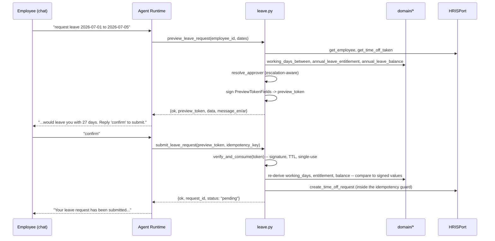

# Architecture

This document describes the shape of the system: the layers, the two workflows' request flows, and
how the agent runtime ties them together. For the reasoning behind individual choices, see
[DECISIONS.md](DECISIONS.md) (a scannable index) and [ROADMAP.md](ROADMAP.md) (the full narrative,
including what was verified live and what's honestly left undone).

## Layers

```
app/api/          FastAPI routes -- POST /chat, GET / (the web portal)
app/agent/         Tool registry, identity binding, the generate -> execute -> generate loop
app/integrations/llm/    LLMPort: mock (default) and Gemini adapters
app/api/tools/     Orchestration -- the only place I/O (HRIS, Dashboard, LLM results) meets domain math
app/domain/        Pure functions, zero I/O -- every number the system reports is computed here
app/integrations/  HRISPort and DashboardPort: in-memory (default) and real (BambooHR, Sheets) adapters
app/core/          Cross-cutting: idempotency, preview tokens, audit log, i18n, scheduling, errors
app/jobs/          Scheduled work (the Iqama expiry scan), callable directly or via app/core/scheduler.py
```

The dependency direction is one-way: `api` depends on `agent`, `agent` depends on `tools`, `tools`
depend on `domain` and the ports in `integrations`, and nothing downstream ever imports back up. A
vendor's wire format (BambooHR's JSON shape, Gemini's `Content`/`Part` objects, Sheets' row arrays)
never crosses an adapter's own file -- everything past that boundary is a domain dataclass.

## The five core decisions

**D1 -- Thin tools, pure domain.** The LLM and every vendor adapter are trusted with exactly zero
arithmetic. `app/domain/*.py` computes leave balances, working days, tenure, gratuity, SLA breach,
and escalation eligibility as pure functions with no I/O -- fully unit-tested without a database, an
HTTP mock, or a model in the loop. `app/api/tools/*.py` orchestrates: fetch data through a port, call
a domain function, shape the response. If a number in a tool response is wrong, the bug is in
`domain/`, not in a tool, an adapter, or a prompt.

**D2 -- Ports & adapters, env-driven.** `HRISPort`, `DashboardPort`, and `LLMPort` are
`typing.Protocol` classes (structural typing, not inheritance -- an adapter satisfies a port by
having the right methods, not by extending a base class). Each has an in-memory/mock adapter as the
default and a real adapter selected by an environment variable (`HRIS_DRIVER`, `DASHBOARD_DRIVER`,
`LLM_DRIVER`). `app/deps.py` caches one instance per distinct settings value for the process's
lifetime. This is why `make test` and `make demo` need no credentials, and why swapping BambooHR for
a different HRIS later touches one adapter file, not the tool layer.

**D3 -- Two-phase writes with signed preview tokens.** Every leave request goes through
`preview_leave_request` (computes the real numbers, signs them with HMAC-SHA256 into an opaque
token, TTL 15 minutes) before `submit_leave_request` (verifies the signature, re-checks every number
against current data -- balance, approver, working-day count -- and only then writes). A signature
alone isn't enough: the world can change in the 15-minute window, so submission re-derives everything
from scratch and compares, rather than trusting what was true at preview time. See
[EDGE_CASES.md](EDGE_CASES.md) for exactly what triggers `BALANCE_CHANGED`.

**D4 -- Idempotency on every mutating tool.** `submit_leave_request`, `decide_leave_request`, and
`submit_daily_checkin` each take an `idempotency_key` and run their write through
`IdempotencyStore.run`, which uses a SQLite `PRIMARY KEY` insert as the concurrency gate: only one
concurrent call with the same key can win the insert, so there's no race window between "check if
this ran already" and "run it." A replay returns the original cached response; a genuinely different
request reusing an old key is refused, not silently overwritten.

**D5 -- Structured, recoverable errors.** Nothing returns a bare exception or an HTTP 500 to the
agent. Every tool failure is a `ToolError` --
`{ok: false, code, message_en, message_ar, recovery_hint, data}` -- with `code` a stable machine-
readable string an agent can branch on and `recovery_hint` written for the model to act on (retry,
re-preview, escalate to HR), not for a human reading a log. The full catalogue is
[EDGE_CASES.md](EDGE_CASES.md).

## Request flow: leave management



`decide_leave_request` (a manager approving or rejecting) re-derives the authorized approver
server-side via the same escalation-aware `resolve_approver` the preview used, rather than trusting
whoever the chat message claims is deciding -- an injected "act as the manager" is harmless because
the tool was never given a parameter that could carry a claimed identity into the authorization
check (`app/agent/tools.py` binds the acting employee from the authenticated `/chat` request, not
from anything the model outputs).

## Request flow: daily check-in and team performance

`submit_daily_checkin` converts the request's UTC timestamp to `Asia/Riyadh` before taking the
calendar date (`app/core/company_time.py`) -- a check-in submitted late in the UTC evening is
correctly filed under the next Riyadh day. `get_team_summary` and `list_missing_checkins` resolve
"who is on this manager's team" via `HRISPort.list_direct_reports` (ids only -- every caller of this
one just needs the set to filter something else by), then call `DashboardPort.get_checkins`, which
already scopes results to the requested employees and date range and collapses same-day
resubmissions to the latest one. The domain layer (`domain/checkins.py`) only aggregates what it's
given -- missing-employee-id computation and the average rating -- rather than re-implementing
filtering the adapter boundary already did.

## The agent runtime

`LLMPort.generate(system_prompt, history, tools) -> Message` is provider-agnostic: `Message` and
`ToolCall` are this system's own shapes, not Gemini's. `app/agent/runtime.py`'s loop is: call
`generate`; if the result carries tool calls, execute each one (`app/agent/tools.py` dispatches by
name to the real tool function, injecting `ChatDeps` -- the shared singletons -- and a
`ToolContext` scoped to that one call), append each result as a tool-role message, and call
`generate` again; stop once a call returns plain text. `MAX_TOOL_ITERATIONS = 6` bounds a
misbehaving model, not a legitimate chain (the longest real chain, preview-then-confirm, is two
calls across two separate user turns, not one).

Two properties are enforced at the tool-registry boundary, not left to model behavior:

- **Identity is bound server-side.** No tool's JSON schema includes a parameter that would let the
  model claim to be a different employee for a self-referential action.
  `ToolContext.acting_employee_id` comes from the `/chat` request only.
- **Idempotency keys are derived, not model-supplied.** `ToolContext.idempotency_key()` builds the
  key from the tool-call id the provider (or the mock) assigned that specific invocation --
  exactly the kind of value D1 says a model shouldn't be trusted to invent.

## Bilingual support

Every tool response carries both `message_en` and `message_ar`. `app/core/i18n.py` detects the
input's script (a regex over the Arabic Unicode block, `[؀-ۿ]`) and resolves a reply language from
that plus the employee's stored preference, detected script winning. The same regex is duplicated
exactly (not approximated) in three places that all need to agree: the backend
(`_ARABIC_SCRIPT_RE`), the mock LLM's result-relay logic, and the web portal's client-side bubble
direction -- so a message is never rendered left-to-right by the browser while the backend treated it
as Arabic, or vice versa. Hijri date rendering uses a tabular (arithmetic, not moon-sighting)
Gregorian-Hijri conversion, epoch verified empirically against two independently-sourced reference
dates rather than trusted from a commonly-cited constant that turned out to be off by a day.

## Scheduled work

`app/jobs/iqama_expiry.py` is a plain, directly-callable async function -- not something that only
works inside APScheduler. `app/core/scheduler.py` wires it to a daily cron trigger (explicit
`Asia/Riyadh` timezone; APScheduler defaults to the server's local time otherwise) and is only
started from `main.py`'s lifespan when `IQAMA_SCHEDULER_ENABLED=true`, so tests and CI never spin up
a background thread by accident.
